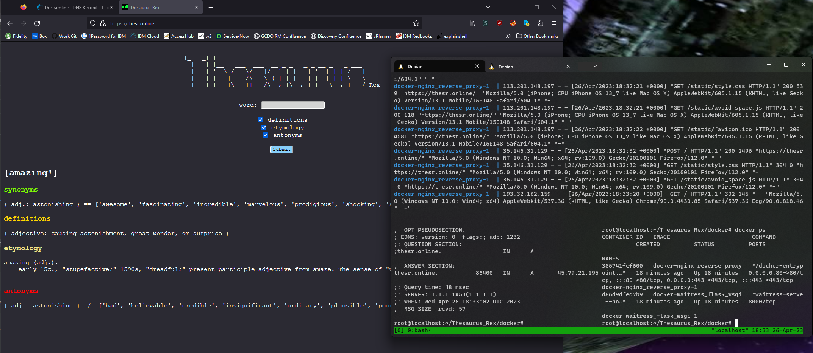
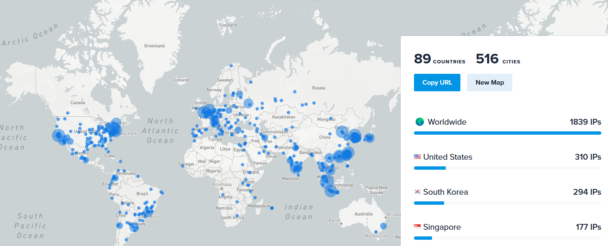
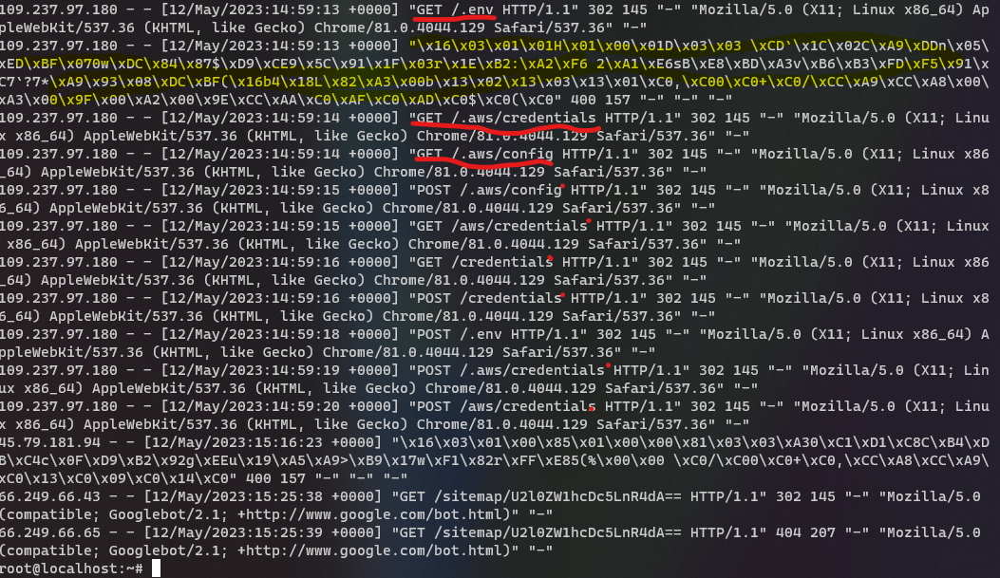

# Thesaurus-Rex
Thesaurus tool that fetches a word's homonyms, synonyms, and antonyms from [Thesaurus.com](https://www.thesaurus.com/). It's also a dictionary tool that fetches definitions from [Webster](https://www.merriam-webster.com/). It fetches etymology information from [etymonline](https://www.etymonline.com/).

### Installation
- from [PyPI](https://pypi.org/project/thesr): `pip install thesr`
- from [GitHub](https://github.com/treatmesubj/Thesaurus_Rex): `pip install "git+https://github.com/treatmesubj/Thesaurus_Rex"`

### Usage

```
python -m thesr.thesr [-h] [--word WORD] [--define] [--etymology] [--antonyms] [--verbose]
```
Common English phrases & idioms such as `toungue-and-cheek` or `dime-a-dozen` sometimes work as well

```
john@spectre:~
$ python -m thesr.thesr -w purport -v

         _____ _
        |_   _| |
          | | | |__   ___  ___  __ _ _   _ _ __ _   _ ___
          | | | '_ \ / _ \/ __|/ _` | | | | '__| | | / __|
          | | | | | |  __/\__ \ (_| | |_| | |  | |_| \__ \
          |_| |_| |_|\___||___/\__,_|\__,_|_|   \__,_|___/ Rex

[purport!]

---Synonyms-------------------------------------------------------------------
{ noun: meaning, implication } == ['acceptation', 'aim', 'bearing', 'burden', 'connotation', 'core', 'design',
'drift', 'gist', 'heart']
{ verb: assert, mean } == ['imply', 'pose as', 'pretend', 'profess', 'allege', 'betoken', 'claim', 'convey',
'declare', 'denote']
--------------------------------------------------------------------------------

---Definitions-------------------------------------------------------------------
{ verb: to have the often specious appearance of being, intending, or claiming (something implied or inferred) }
{ verb: claim  }
{ verb: intend, purpose }
{ noun: meaning conveyed, professed, or implied : import }
{ noun: substance, gist }
--------------------------------------------------------------------------------

---Etymology-------------------------------------------------------------------
purport (n.)
    early 15c., "meaning, tenor, the surface or expressed meaning of a document, etc.; that which is conveyed or
expressed," from Anglo-French purport (late 13c.), Old French porport "contents, tenor," back-formation from
purporter "to contain, convey, carry; intend," from pur- (from Latin pro- "forth;" see pur-) + Old French porter "tocarry," from Latin portare "to carry" (from PIE root *per- (2)  "to lead, pass over"). Meaning "that which is to be done or effected" is from 1650s.
--------------------
purport (v.)
    1520s, "indicate, express, set forth, convey to the mind as the meaning or thing intended," from the noun in Englishand from Anglo-French purporter (c. 1300), from Old French purporter "to contain, convey, carry; intend," from pur- (from Latin pro- "forth;" see pur-) + Old French porter "to carry," from Latin portare "to carry" (from PIE root
*per- (2)  "to lead, pass over"). Related: Purported; purporting.
--------------------------------------------------------------------------------

---Antonyms-------------------------------------------------------------------
{ noun: meaning, implication } =/= ['exterior', 'exteriority', 'insignificance', 'meaninglessness', 'outside',
'surface']
{ verb: assert, mean } =/= ['conceal', 'deny', 'disclaim', 'hide']
--------------------------------------------------------------------------------
```

## [Thesaurus-Rex Web Server](./docker_k8s)
### [thesr.online](https://thesr.online)
Check out Thesaurus-Rex's ~~[Docker](https://www.docker.com/) (Compose)~~ [Kubernetes](https://kubernetes.io/) containerized web experience built with an [NGINX](https://www.nginx.com/) hardened reverse proxy & TLS/SSL encryption container in front of a containerized [Waitress](https://docs.pylonsproject.org/projects/waitress/en/stable/) web server & [Flask](https://flask.palletsprojects.com/en/2.2.x/) framework Python application.\
It's running on a [ufw](https://wiki.debian.org/Uncomplicated%20Firewall%20%28ufw%29) firewalled Debian virtual machine in the cloud courtesy of [Linode](https://www.linode.com/).\
[fail2ban](https://github.com/fail2ban/fail2ban) protects the server from bruteforce attacks. Though, RSA asymetric cryptographic public-encrypt-key/private-decrypt-key pairs are used for administration of the host; OpenSSH server's password authentication is disabled.\
I bought the [thesr.online](https://thesr.online) domain from [Hover](https://www.hover.com/).\
The TLS/SSL cryptographic certificate for the [thesr.online](https://thesr.online) domain is validated & signed by the [Let's Encrypt](https://letsencrypt.org/) [open source](https://github.com/letsencrypt/boulder) certificate authority.



#### The Internet's Spooky
[https://thesr.online](https://thesr.online) has been on the internet for about 2 weeks now (5/12/23).\
Here's a geo-map of thousands of malicious IP addresses that tried to bruteforce guess my credentials to gain control of my server from just some of the logs.\
Also, here's a sample of the latest traffic to my server from the logs, showing probably botnets, trying to extract credentials, upload binary data, and exploit old software vulnerabilities.

\


### [Docker Compose](https://docs.docker.com/compose/) -> [Kubernetes](https://kubernetes.io/)
I first used [Kompose](https://github.com/kubernetes/kompose) to roughly translate my Docker Compose files to K8s resources.\
Then, I used [k3s](https://k3s.io/) to run a local cluster to develop and test my project.\
I learned, asked, and answered some StackOverflow questions about [Linux network
interfaces](https://stackoverflow.com/a/79406073/11255791) and more about
[Linux DNS resolution
configuration](https://stackoverflow.com/a/79407204/11255791).\
I used [Helm](https://helm.sh) to deploy the workload to my cluster.\
My Nginx reverse proxy remains in place as a `Deployment` mounting the
Letsencrypt certifcates via `PersistentVolumeClaim` and a `LoadBalancer` service routes
external traffic to Nginx.\
A `CronJob` attempts to renew my Letsencrypt certificates every 15 days.

See [docker\_k8s/README.md](./docker_k8s/README.md) for the detailed steps.

*Update (02/12/25):* Turns out k8s IPv6 needs some extra configuration, so I've removed the IPv6 DNS AAAA record for `thesr.online` for now.


